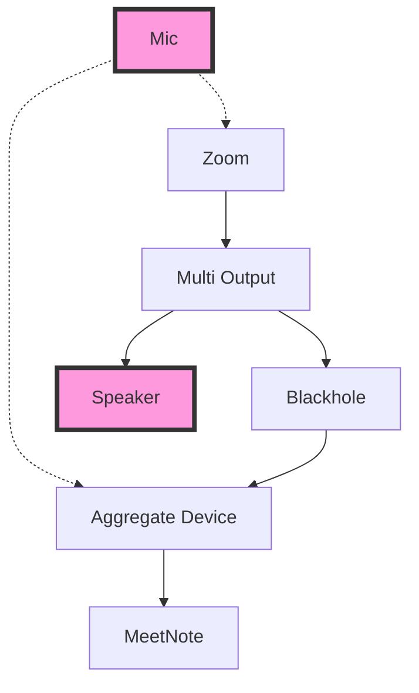

# MeetNote

Complete Zoom recording, transcription, and summarization all at once

 * Record zoom voice automatically
 * Transcribe the voice
 * Summarize the transcription

## Supported platforms

  * Mac OS Ventura or later
  * Java 17+

## Permission

This application requires "Accessibility" permission to get the list of windows.

## Dependencies

### Lame

    brew install lame

音声ファイルを mp3 にするために lame を利用する。
  
### Blackhole

音声とマイクを両方録音するために以下のようにして BlackHole を入れる。

    brew install blackhole-2ch

で、以下のようにつなげる。

## Build

    ./gradlew packageDmg

## License

The MIT License (MIT)

Copyright © 2023 Tokuhiro Matsuno, http://64p.org/ <tokuhirom@gmail.com>

Permission is hereby granted, free of charge, to any person obtaining a copy
of this software and associated documentation files (the “Software”), to deal
in the Software without restriction, including without limitation the rights
to use, copy, modify, merge, publish, distribute, sublicense, and/or sell
copies of the Software, and to permit persons to whom the Software is
furnished to do so, subject to the following conditions:

The above copyright notice and this permission notice shall be included in
all copies or substantial portions of the Software.

THE SOFTWARE IS PROVIDED “AS IS”, WITHOUT WARRANTY OF ANY KIND, EXPRESS OR
IMPLIED, INCLUDING BUT NOT LIMITED TO THE WARRANTIES OF MERCHANTABILITY,
FITNESS FOR A PARTICULAR PURPOSE AND NONINFRINGEMENT. IN NO EVENT SHALL THE
AUTHORS OR COPYRIGHT HOLDERS BE LIABLE FOR ANY CLAIM, DAMAGES OR OTHER
LIABILITY, WHETHER IN AN ACTION OF CONTRACT, TORT OR OTHERWISE, ARISING FROM,
OUT OF OR IN CONNECTION WITH THE SOFTWARE OR THE USE OR OTHER DEALINGS IN
THE SOFTWARE.
