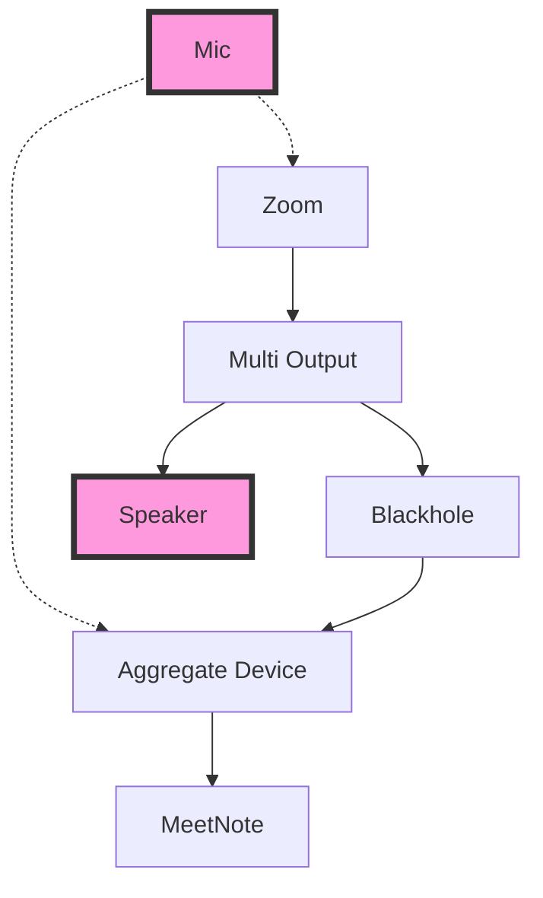

# MeetNote

Complete Zoom recording, transcription, and summarization all at once

## Supported platforms

  * Mac OS Ventura or later
  * Java 17+

## Dependencies

### Lame

    brew install lame

音声ファイルを mp3 にするために lame を利用する。
  
### Blackhole

音声とマイクを両方録音するために以下のようにして BlackHole を入れる。

    brew install blackhole-2ch

で、以下のようにつなげる。

